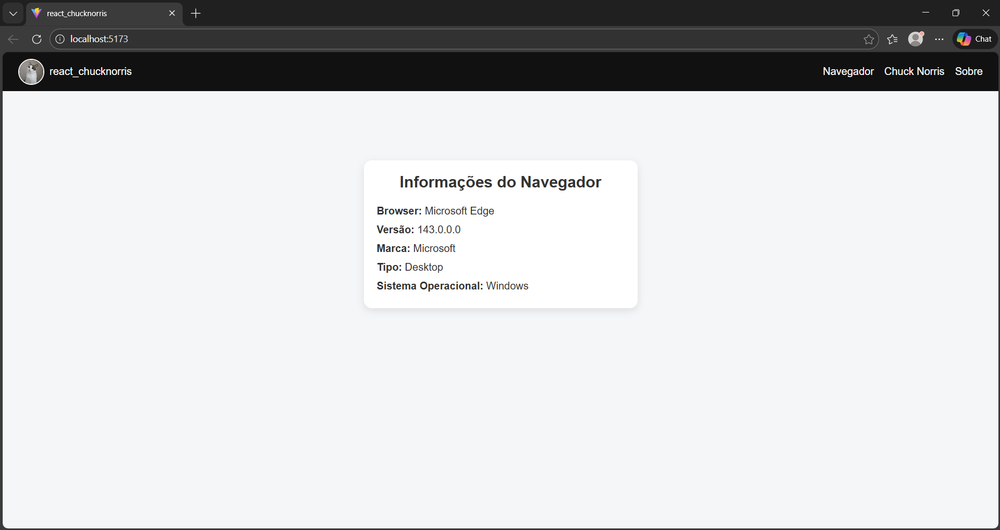
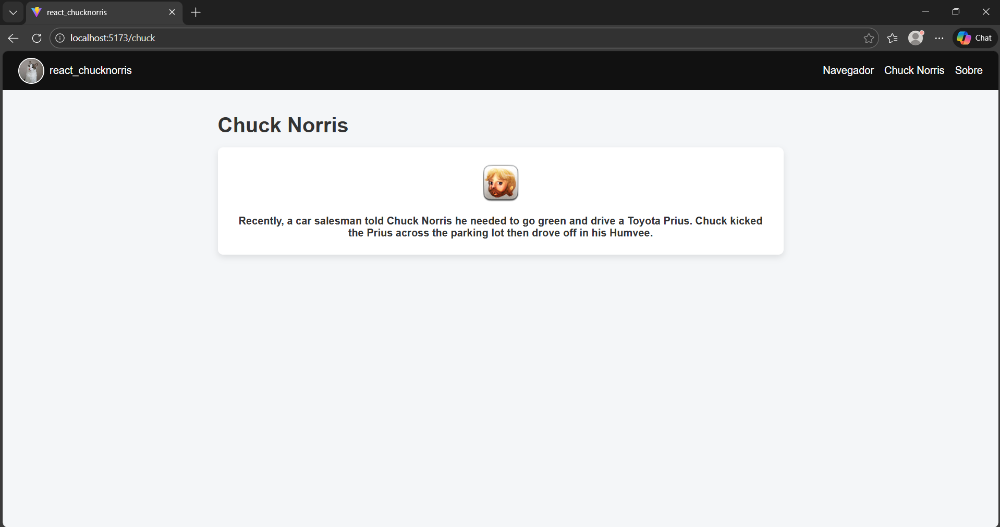
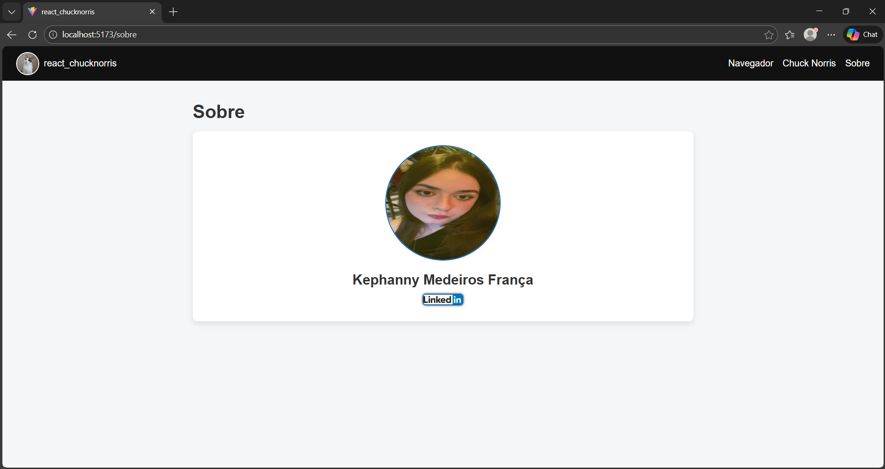

# 👩‍💻 react_chucknorris

## 📌 Descrição do Projeto

O react_chucknorris é um projeto que consome 3 APIs públicas para exibir um avatar circular personalizado aleatório, informações sobre o navegador do usuário e curiosidades aleatórias do Chuck Norris, além de uma página sobre o desenvolvedor, utilizando uma interface simples, responsiva e sem bibliotecas de UI externas.

A aplicação possui navegação entre páginas, um menu fixo com avatar dinâmico e tratamento de erros para falhas nas APIs.

---

## 🛠️ Tecnologias Utilizadas

- **React 18**
- **Vite**
- **React Router DOM (v6)**
- **JavaScript (ES6+)**
- **CSS puro**
- **Fetch API**
- **APIs externas**:
  - Cataas (avatar de gato)
  - Chuck Norris API
  - CAgent API (informações do navegador)

---

## ▶️ Como Executar o Projeto Localmente

Siga os passos abaixo para rodar o projeto em sua máquina:

### Pré-requisitos
- Node.js **versão 20 ou superior**
- NPM (instalado junto com o Node)

### Passo a passo

```bash
# Clone o repositório
git clone https://github.com/SEU_USUARIO/react_chucknorris.git
```

### Acesse a pasta do projeto
```bash
cd react_chucknorris
```

### Instale as dependências
``` bash
npm install
```

### Abra 2(dois) terminais
- 1 para rodar o backend
- 2 para rodar a aplicação

### Inicialize o backend no 1º terminal
``` bash
cd server
node index.js

Saída >>> Backend rodando em http://localhost:3001
```
### Execute o projeto em modo de desenvolvimento no 2º terminal
``` bash
npm run dev
```
# Após isso, acesse no navegador:
http://localhost:5173

### Para fechar a aplicação execute nos dois terminais:
``` bash
Ctrl + C
```

## 📸 Screenshots da Aplicação

### 🏠 Tela Inicial


### 📖 Tela - Chuck Norris


### ⭐ Tela - Sobre


Este projeto foi desenvolvido como parte da avaliação da disciplina Frontend Frameworks, com o objetivo de praticar o uso de React, consumo de APIs externas, componentização e boas práticas de desenvolvimento frontend.# react-chucknorris
